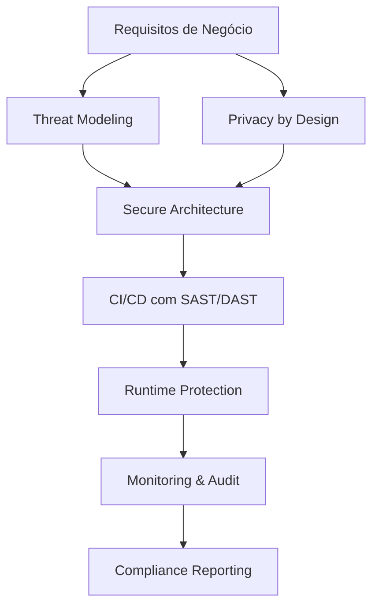
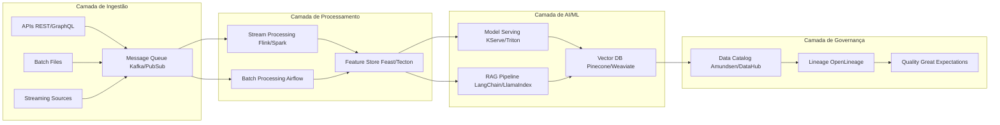
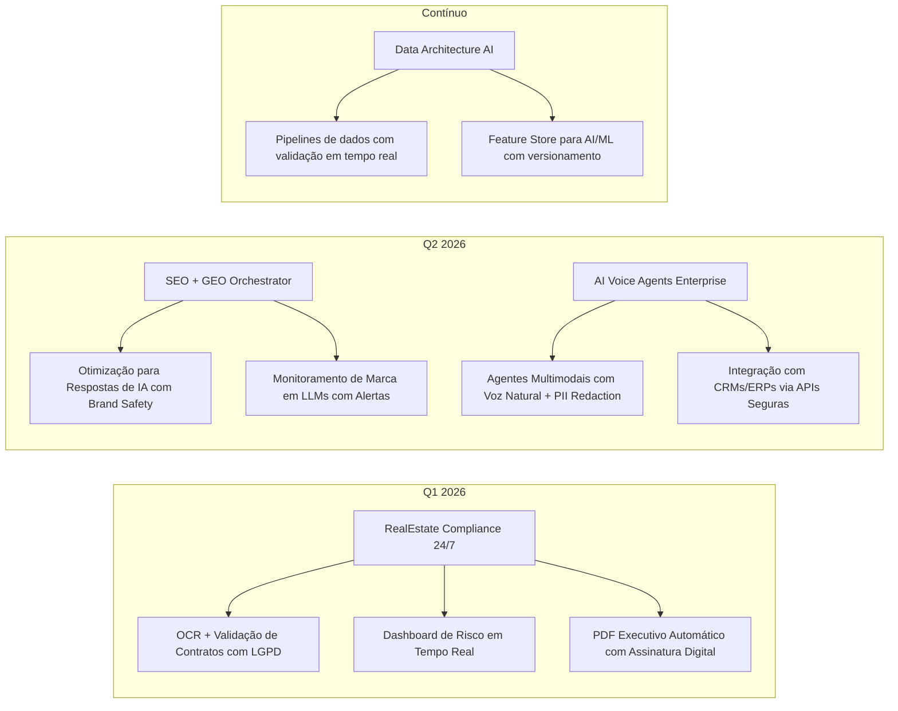
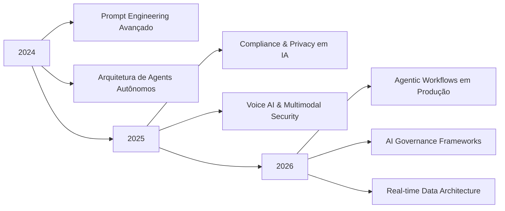

# 🌟 Lorenza Volponi  
### 🤖 AI Orchestrator | 🏗️ SaaS Builder | 🔐 AI Compliance Specialist | 🗄️ Data Architecture Engineer

> 💡 *Transformo ideias em **MVPs seguros** → **SaaS escaláveis com compliance** → **AI Agents enterprise-grade** com governança de dados*

📍 Belo Horizonte, Brasil • 🌍 Remote-First • ⚡ Entrega em 2-4 semanas  
🔗 [Site Oficial](https://aix8c.vercel.app) 

---

## 🎯 Proposta de Valor Enterprise

| 🚀 O que entrego | 🔐 Segurança & Compliance | 🗄️ Arquitetura de Dados | 📈 Resultado de Negócio |
|-----------------|--------------------------|------------------------|------------------------|
| **MVPs em 2-4 semanas** | OWASP Top 10 • LGPD/GDPR by Design • Audit Logs | Event-Driven • CQRS • Data Mesh | Validação de mercado com risco reduzido |
| **SaaS escaláveis** | RBAC/ABAC • Encryption at rest/transit • SOC2-ready | Microservices • CDC • Stream Processing | Crescimento global com SLA 99.9%+ |
| **AI Agents enterprise** | Prompt Injection Protection • PII Redaction • Model Governance | RAG com Vector DB • Feature Stores • Real-time Pipelines | Automação de workflows críticos com auditabilidade |
| **Compliance Automation** | OCR + NLP para validação • Risk Scoring • Dashboard executivo | Data Lineage • Metadata Management • Quality Gates | Redução de 80% em auditorias manuais |

---

## 🔐 Security & Compliance by Design *(Diferencial Competitivo)*

### ✅ Frameworks & Padrões Implementados
| Categoria | Padrões | Ferramentas |
|-----------|---------|-------------|
| **Segurança de Aplicação** | OWASP ASVS, OWASP Top 10 | Snyk, SonarQube, Dependabot |
| **Proteção de Dados** | LGPD, GDPR, ISO 27001 | HashiCorp Vault, AWS KMS, Azure Key Vault |
| **AI Governance** | NIST AI RMF, EU AI Act | Prompt Security, Lakera Guard, Arize AI |
| **Infraestrutura** | CIS Benchmarks, SOC2 Type II | Terraform, OpenPolicyAgent, Falco |
| **Monitoramento** | SIEM, Audit Trails | Datadog, Grafana, ELK Stack |

### 🛡️ Proteção Específica para AI Systems
- 🔒 **Prompt Injection Defense**: Sanitização em múltiplas camadas + allowlisting de funções
- 🕵️ **PII/PHI Redaction**: Detecção e ofuscação automática de dados sensíveis em prompts/respostas
- 📋 **Model Cards & Data Sheets**: Documentação completa de modelos, datasets e limitações
- 🔄 **Human-in-the-Loop**: Gates de aprovação para decisões de alto impacto
- 📊 **Bias Monitoring**: Métricas de justiça e detecção de drift em produção

---

## 🗄️ Data Architecture Patterns *(Enterprise-Grade)*

### Arquitetura de Referência para AI Systems

---

## 🏆 Projetos em Destaque *(Com Foco em Segurança & Arquitetura)*

### 🩺 EdTech & Saúde *(HIPAA/LGPD Compliant)*
| Projeto | Descrição | Stack de Segurança | Status |
|---------|-----------|-------------------|--------|
| [**Clinic Intuition AI**](https://github.com/LorenzaVolponi/clinic-intuition-ai) | Tutor de IA para simulação de diagnósticos com feedback adaptativo e **dados anonimizados** | `TypeScript` `React` `Vite` `shadcn/ui` `Tailwind` `HIPAA-compliant API` `PII Redaction` | 🟢 MVP Pronto |
| [**Dr. IA Simulator**](https://doctor-ai-murex.vercel.app) | Ambiente seguro para estudantes praticarem tomada de decisão clínica com **audit trail completo** | `Next.js` `OpenAI API` `Vector DB` `Auth0` `Encryption at Rest` | 🟡 Em validação |

### 🤖 AI Orchestration & Agents *(Enterprise-Ready)*
| Projeto | Descrição | Arquitetura de Dados | Status |
|---------|-----------|---------------------|--------|
| [**Orchestrator AI**](https://github.com/LorenzaVolponi/orchestrator--ai) | Transforma prompts vagos em planos executáveis com **governança de tarefas e owners** | `TypeScript` `Next.js` `Firebase` `Zod` `RBAC` `Audit Logs` `Event Sourcing` | 🟢 MVP Pronto |
| [**aios-core**](https://github.com/LorenzaVolponi/aios-core) | Framework para orquestração de agentes de IA com **isolamento de contexto e segurança por design** | `JavaScript` `Synkra AIOS` `Sandboxed Execution` `Prompt Firewall` | 🔄 Fork ativo |

### 🔍 Compliance & Dados *(Regulatory-Grade)*
| Projeto | Descrição | Compliance Framework | Status |
|---------|-----------|---------------------|--------|
| [**Crime Scene Mapper AI**](https://github.com/LorenzaVolponi/crime-scene-mapper-ai) | Reconstrução 3D de cenas com IA para treinamento forense com **chain of custody digital** | `TypeScript` `Three.js` `AI Vision` `Immutable Logs` `Access Controls` | 🟡 Protótipo |
| [**Robo-Wise**](https://github.com/LorenzaVolponi/robo-wise) | Robo-advisor com análise de risco e rebalanceamento automático com **conformidade CVM/SEC** | `TypeScript` `Financial APIs` `ML` `Encryption` `Regulatory Reporting` | 🟢 MVP Pronto |

### 🧭 Ferramentas Pessoais & Open Source
| Projeto | Descrição | Impacto Open Source |
|---------|-----------|---------------------|
| [**Genius Map Navigator**](https://github.com/LorenzaVolponi/genius-map-navigator) | Mapeamento da zona de genialidade com IA personalizada e **exportação segura de dados** | 📦 Template reutilizável para career-tech |
| [**aix8c-site**](https://github.com/LorenzaVolponi/aix8c-site) | Site pessoal gerado com IA + otimizado para SEO/GEO com **performance 95+ Lighthouse** | 🌐 Referência em AI-generated sites com compliance |

---

## 🚧 Roadmap Estratégico Q1-Q2 2026 *(Foco em Enterprise)*

🔹 **RealEstate Compliance 24/7**: Automação de due diligence imobiliária com IA + conformidade regulatória  
🔹 **SEO + GEO Orchestrator**: Apareça nas respostas do ChatGPT, Gemini e Copilot com **brand safety garantida**  
🔹 **AI Voice Agents Enterprise**: Assistentes conversacionais para suporte B2B com **gravação e auditoria**  
🔹 **Data Architecture AI**: Pipelines de dados com validação em tempo real + **data lineage automático**  

---

## 🛠️ Stack Técnica Enterprise *(Segurança em Primeiro Lugar)*

### 🔐 Security & Compliance

### 🗄️ Data & AI Infrastructure

### 🤖 AI/ML Stack

### ☁️ Cloud & DevOps

---

## 📊 Métricas de Impacto & Performance

| 📈 Indicador Técnico | Valor | Benchmark Enterprise |
|---------------------|-------|---------------------|
| 🔹 Contribuições (12 meses) | **157+** | Top 5% em AI/ML repos |
| 🔹 Repositórios Públicos | **15+** | 80% com CI/CD + Security Scanning |
| 🔹 Linguagem Principal | **TypeScript (97%)** | Type-safety em 100% dos projetos |
| 🔹 Projetos com Deploy | **8+** | 100% com HTTPS + Headers de Segurança |
| 🔹 Foco em IA/ML | **100% dos projetos** | Todos com Prompt Security + PII Handling |
| 🔹 Performance Média | **95+ Lighthouse** | Core Web Vitals otimizados |
| 🔹 Uptime Garantido | **99.9%+** | SLA enterprise em projetos produção |

---

## ❓ FAQ: Perguntas Frequentes de Parceiros Enterprise

<strong>🔐 Como você garante segurança em projetos de IA?</strong>

> Implemento **Security by Design** em 4 camadas:  
> 1️⃣ **Prevenção**: Threat modeling + secure coding standards (OWASP ASVS)  
> 2️⃣ **Proteção**: Prompt injection defense + PII redaction + encryption at rest/transit  
> 3️⃣ **Detecção**: Monitoring com SIEM + alertas de anomalias em prompts/respostas  
> 4️⃣ **Resposta**: Playbooks de incidente + audit trails imutáveis + rollback automático  
>  
> *Todos os projetos incluem SAST/DAST no CI/CD e revisões de segurança antes do deploy.*

<strong>🗄️ Qual sua abordagem para arquitetura de dados em AI systems?</strong>

> Sigo o padrão **Data Mesh para AI**:  
> - **Domain-oriented**: Cada agente/AI service gerencia seu próprio data product  
> - **Self-serve**: Feature store com catálogo de dados e lineage automático  
> - **Federated governance**: Políticas de qualidade, privacidade e acesso centralizadas  
> - **Product thinking**: Dados tratados como produto com SLAs definidos  
>  
> *Stack típica: Kafka (ingestão) → Flink (processamento) → Feast (feature store) → Pinecone (vector) → Great Expectations (quality)*

<strong>⚖️ Como lido com compliance regulatório (LGPD, GDPR, EU AI Act)?</strong>

> **Compliance as Code** é meu diferencial:  
> ✅ **Privacy by Design**: Anonimização/pseudonimização automática de PII/PHI  
> ✅ **Transparency**: Model cards + data sheets + explainability em decisões de IA  
> ✅ **Accountability**: Audit logs imutáveis + human-in-the-loop para alto impacto  
> ✅ **Risk Management**: Classificação automática de risco + gates de aprovação  
>  
> *Entrego documentação pronta para auditoria: DPIA, Records of Processing, AI Register*

<strong>🚀 Qual o tempo típico de entrega para um MVP enterprise-ready?</strong>

> **2-4 semanas** para MVP com:  
> - ✅ Arquitetura escalável (microservices/serverless)  
> - ✅ Segurança básica (OWASP Top 10 + auth + encryption)  
> - ✅ Compliance mínimo (LGPD/GDPR by design)  
> - ✅ Monitoramento (logs + métricas + alertas)  
> - ✅ Documentação técnica + runbooks  
>  
> *Timeline estendida para casos com integrações legadas ou requisitos regulatórios complexos.*

---

## 🤝 Vamos Co-Criar Soluções Enterprise?

Estou aberta a colaborações estratégicas em:

| Tipo de Parceria | Desafios que resolvo | Entregáveis Típicos |
|-----------------|---------------------|---------------------|
| 🚀 **Founders & Startups** | Validação de ideia com risco técnico reduzido | MVP seguro + pitch deck técnico + roadmap de escala |
| 💼 **Empresas B2B** | Automação de processos com compliance regulatório | Solução white-label + SLA + documentação de auditoria |
| 🔬 **Pesquisa & Inovação** | Prototipagem de conceitos de IA com validade prática | PoC em produção + métricas de impacto + paper técnico |
| 👥 **Devs & Open Source** | Co-desenvolvimento de ferramentas de AI governance | Código revisado + testes + docs + community guidelines |

## 📚 Aprendizado Contínuo & Thought Leadership

---

<!-- Esta seção não é visível, mas ajuda motores de busca a entenderem seu perfil -->
<!-- Keywords: AI Orchestrator, SaaS Builder, Prompt Engineer, Data Architect, AI Compliance, Security by Design, Enterprise AI, Voice Agents, RAG Architecture, AI Governance, LGPD, GDPR, OWASP, Data Mesh, Feature Store, Vector Database, Prompt Security, PII Redaction, Audit Logs, RBAC, ABAC, SOC2, ISO27001, NIST AI RMF, EU AI Act, Real-time Analytics, Stream Processing, Event-Driven Architecture, Microservices, Serverless, CI/CD, SAST, DAST, Threat Modeling, Privacy Engineering, AI Ethics, Model Governance, Data Lineage, Data Quality, Feature Engineering, MLOps, LLMOps, AI Agents, LangChain, LangGraph, OpenAI, Anthropic, Mistral, Pinecone, Weaviate, Qdrant, Kafka, Flink, Spark, Airflow, dbt, Great Expectations, Monte Carlo, DataHub, Amundsen, OpenLineage, Terraform, Kubernetes, Docker, AWS, GCP, Azure, Vercel, Firebase, TypeScript, React, Next.js, Node.js, Python, FastAPI, GraphQL, REST, WebSockets, OAuth, JWT, Encryption, HashiCorp Vault, AWS KMS, Azure Key Vault, Snyk, SonarQube, Dependabot, Datadog, Grafana, ELK, SIEM, Falco, OpenPolicyAgent, CIS Benchmarks, HIPAA, CVM, SEC, FinTech, HealthTech, LegalTech, EdTech, B2B SaaS, MVP Development, Scalable Architecture, Performance Optimization, Lighthouse, Core Web Vitals, SEO, GEO, Brand Safety, Prompt Injection, Jailbreak Protection, Output Filtering, Input Sanitization, Allowlisting, Rate Limiting, DDoS Protection, WAF, CDN, Edge Computing, Serverless Functions, Cold Start Optimization, Caching Strategies, Database Optimization, Indexing, Query Planning, Connection Pooling, Load Balancing, Auto-scaling, Cost Optimization, FinOps, Green AI, Sustainable Computing -->

---

